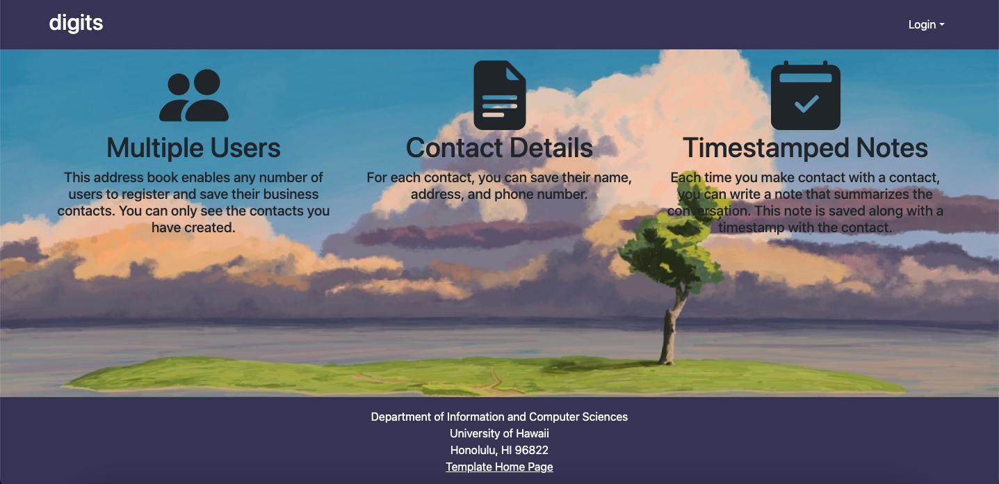
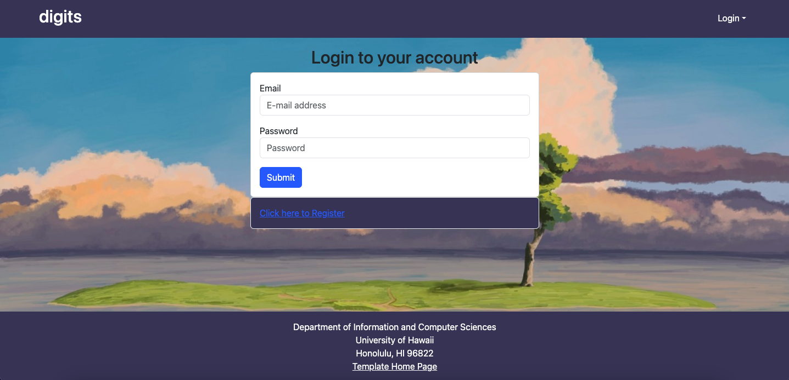
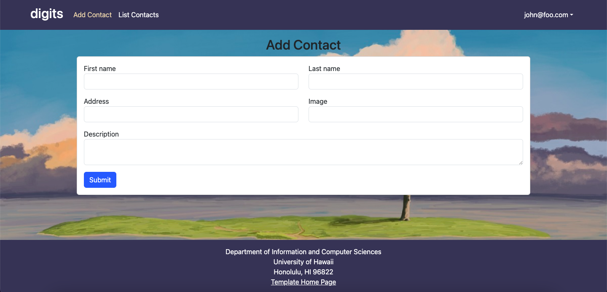
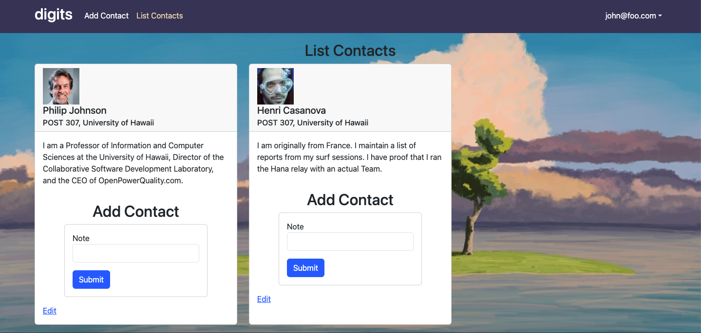

<h5>This application will allow users to:
<ul>
    <li>Create an account.
    <li>Create and edit a collection of contacts.
    <li>Add timestamped notes to any contact. 
</ul>

<h2>Installation
<h5>
1) Install Meteor 
2) Download a copy of the Digits repository. 
3) Run 'meteor npm install' in the app directory
4) Run the application with 'meteor npm run start'
5) View the application at http://localhost:3000. Register with a new account or use the default login within settings.development.json. 
6) Run ESLint with 'meteor npm run lint'.

<h2>Walkthrough of Digit's Pages
<h3>Landing Page
<h5>Lists the components of the Digits page.

<h3>Registration
<h5> By clicking the 'login' dropdown in the top-right corner, the user can sign-in to or register an account. 

<h3>Managing Contacts
<h5> Once logged in, a user can add a contact under the 'Add Contact' tab.

<h5> The user's contacts can be viewed in the 'List Contacts' tab.

<h3>Admin
<h5>Users registered as admins are able to view all contacts and their owners under the 'admin' tab.

